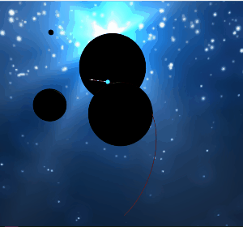

# Space Golf 3D

I started this project to make a 3D remake of one my favorite games from Kongregate:
https://www.kongregate.com/games/funkypear/gravitee.

## Installing dependencies

    npm i

## Running the app

    npm start

## Building the app bundle (for production)

    npm run build

## Running Jest tests

    npm test

## Credits

Skybox: https://sketchfab.com/3d-models/inside-galaxy-skybox-hdri-360-panorama-96183eed1ae2425baddb75ca92103f87 - enhanced by https://letsenhance.io/  
Sounds:

- https://freesound.org/people/michorvath/sounds/269718/
- https://freesound.org/people/DrMaysta/sounds/402994/
- https://freesound.org/people/EminYILDIRIM/sounds/536104/
